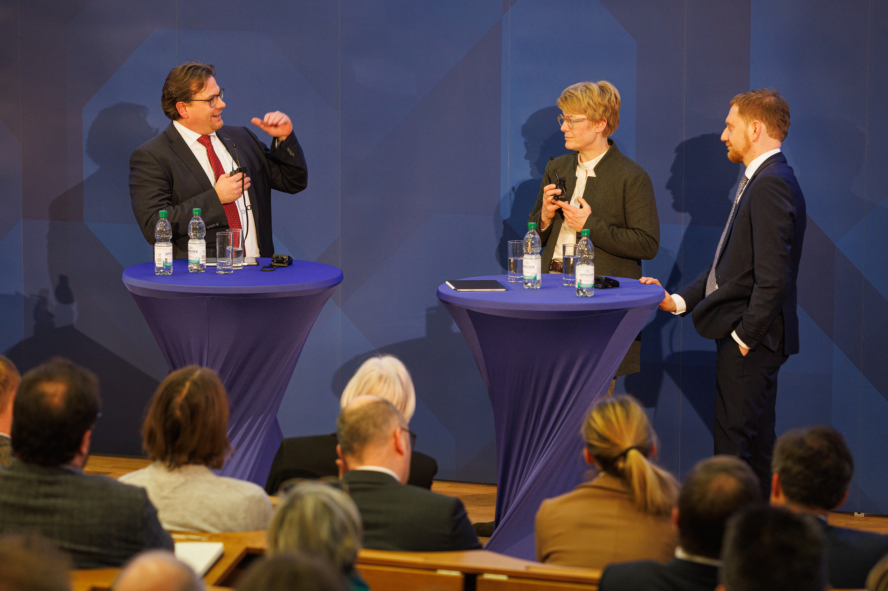

[Home](index.html) | [Research](research.html) | [Publications](publications.html) | [Teaching](teaching.html) | [Media](media.html) | [CV](cv.html)

# Media

## Selected Contributions
- FAZ, *Rente: Dachdecker gegen Doktoren?* (2026)
- Sächsische Zeitung, *Schenken am Limit* (2025)
- Wirtschaftswoche, *Mehr Wachstum durch dezentrale Leuchttürme* (2024)
- FAZ, *VWL aus dem Weltall* (2024)
- FAZ, *Zwischen den Fächern* (2023)

## Outreach

I regularly contribute to public discussions, interviews, panels, and knowledge-transfer events related to economics, public policy, and international economic issues.
