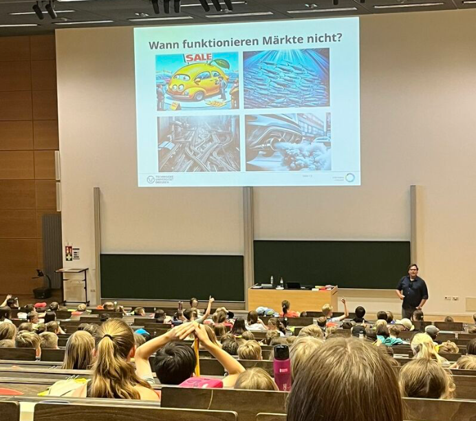

[Home](index.html) | [Research](research.html) | [Publications](publications.html) | [Teaching](teaching.html) | [Media](media.html) | [CV](cv.html)

# Teaching

I teach courses at the undergraduate, master's, and doctoral level in economics.

## Areas of Teaching
- Microeconomics (BSc)
- Macroeconomics (BSc)
- Development economics (MSc)
- International trade (BSc)
- Public economics (BSc, MSc)
- Empirical methods (BSc)
- Causal methods (MSc, PhD)

# Kids and Schools

I teach school classes at a regular level. Topics include: asymmetric information, public goods, renewable resources, and competitive markets. You can download material on classroom games 
here: https://www.dropbox.com/scl/fo/xdj1zv7kd1f5o6j4icgd8/AA_IglS5E7CytrbzMlJylP4?rlkey=91phinh93ftwo5k4pcnaa9wbh&dl=0
